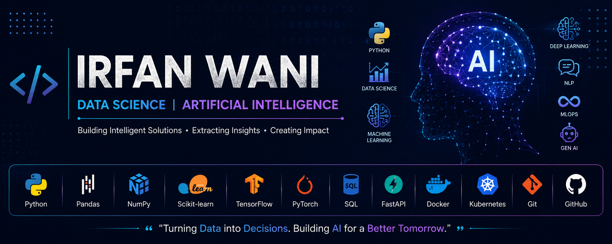

  

<h1 align="center">Hi 👋, I'm Irfan Wani</h1>

  

## 🚀 About Me

🎓 MCA Student at University of Kashmir

💡 Passionate about Data Science and Artificial Intelligence

🌱 Currently learning Machine Learning, Deep Learning, NLP, MLOps and Generative AI.

---

## 💻 Skills

- Python
- SQL
- FastAPI
- Pydantic
- Machine Learning
- Deep Learning
- NLP
- MLOps
- Generative AI
- Git & GitHub

---

## 📚 Current Focus

- Building real-world AI projects
- Learning MLOps
- Improving problem-solving skills
- Exploring Large Language Models (LLMs)

---

## 📫 Connect with Me

- GitHub: https://github.com/irfanwani12
